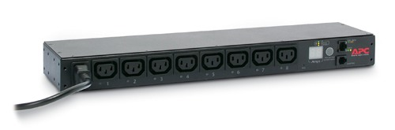
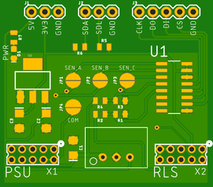

# APC7920 based on ESP32

This is a project that replaces the older and unmaintained microcontroller
units in APC's famous rack PDU, the AP7920.

## Intro to AP7920

The AP7920 is an 8-port switchable rack mounted power distribution unit. It
features three main components:

1.  A power supply board, which has two 24V power supplies (PSU1 and PSU2) and
    three current sensors (Phase A, B and C). Each current sensor measures
    current from 0..30A AC. When sold in Europe, only one of these is used
    (Phase B).
1.  A microcontroller, based on an older Atmel chip, which features serial
    via an RJ12 plug, and 10/100 Ethernet via an RJ45 plug, and a 7-segment
    display which shows load on Phase B.
1.  A relay board, which features a general purpose I2C GPIO expander based on
    PCF8574, and eight 24V relays, one for each port on the front.

The design of this PDU is rather well done, with two power supplies, and a 
decoupled control plane. The wiring is of high quality, even after many
years of service the components are still in pristine shape. Shrink wrap
is used on the wiring for extra safety and the solder quality is very high.

If the microcontroller reboots or fails, the I2C GPIO expander stays put.
This allows operators to upgrade/reboot/tinker-with the management board
without interrupting service to the load.

### Pinouts

#### Power Supply Board

The power supply board has a 10-pin 2mm pitch connector. It exposes the two
24V power supplies, each with their own ground, and the three current sensors,
with their own separate common ground.

The black wire on the ribbon cables is Pin1. 

Pin | Meaning | Pin | Meaning
--- | --- | --- | ---
1 | I-Sens Phase C | 2 | I-Sens GND
3 | I-Sens Phase A | 4 | I-Sens GND
5 | +24V PSU1 | 6 | +24V PSU1
7 | I-Sens Phase B | 8 | GND PSU1
9 | GND PSU2 | 10 | +24V PSU2

It's worth pointing out that on the power supply board, all ground planes
are separated (so there's one ground pin for PSU1, one for PSU2 and one for
the current sensors).

#### Relay Board

The relay board has a 10-pin 2mm pitch connector. It exposes the I2C chip
which takes common `SDA`, `SDL`, `3.3V` and `GND` pins, and exposes three
address pins `ADDR0`, `ADDR1`, and `ADDR2`. This is presumably done so that
the microcontroller can address up to 8 of these relay boards. It also takes
24V in, which is used to drive the relays.

Pin | Meaning | Pin | Meaning
--- | --- | --- | ---
1 | GND | 2 | GND
3 | VDD (3.3V) | 4 | SDA
5 | +24V | 6 | +24V
7 | ADDR0 | 8 | SDL
9 | ADDR1 | 10 | ADDR2

AP7920 only has one expander, so it doesn't really matter which address
the MCU selects.

## Interposer board

This project works by replacing the two ribbon cables that go from the power
supply board and the relay board to the microcontroller. It's designed to
be a plugin replacement -- just remove the connectors from the microcontroller
and plug them into the interposer board instead.

The interposer has a few commponents. Firstly, there's a DC/DC buck converter
which takes 24V from PSU1 and switches it down to 5V. Then, there's a LDO that
takes the 5V and regulates it down to 3.3V. Lastly, there's an ADC chip that
measures the current on Phase A,B,C and the voltage out of PSU1 and PSU2 by 
using voltage divers (the ADC runs at 3.3V so at least a 7:1 divider is necessary
to measure the 24V coming out of the PSUs). The 24V rail from PSU2 is looped
through to the relay board. It exposes its 3.3V rail to the relay board as
well, to power the GPIO expander and a few other components there.

It exposes its ADC chip on the SPI header (taking `CS`, `CLK`, `DI` and `DO`)
and it exposes the GPIO expander from the relay board on the I2C header
(showing `SDA`, `SDL`). It offers the 5V and 3.3V rails on the PWR header.
This is enough to connect any other microcontroller that speaks I2C and SPI
instead of the microcontroller that comes with the AP7920 itself. The
interposer assumes only one PCF8574 chip, so it ties all three address pins
`ADDR0`, `ADDR1` and `ADDR2` to `GND`.

The interposer also ties `GND` together from both PSUs, as the original
microcontroller also does that. It has a solder pad (J4) that allows the
current sensor ground to be tied to the main ground as well. In production,
all four solder pads (J1..J4) should be soldered closed. This connects the
current sensor output to the ADC. You can measure the voltage between J4
and J1..J3 to see the current sensed on Phase A..C.

### BOM

The following components are readily available on Mouser and Digikey. The
full bill of materials for the interposer is as such:

*   R1,R3: 10K Ohm -- voltage divider
*   R2,R4: 75K Ohm -- voltage divider (7:1 minimum)
*   R5,R6: 10K Ohm -- pullup for I2C, optional
*   R7: 220 Ohm -- for blue LED
*   D1: Blue LED 
*   C1: 22uF Tantalum 35V
*   C2,C3: 10uF Tantalum 16V
*   U1: MCP3208 -- 150mil SOIC (Microchip)
*   U2: TSR1-2450 (Traco Power)
*   X1, X2: 5x2 pin 2mm spaced header
*   J1, J2: 3x1 pin 2.54mm spaced header
*   J3: 5x1 pin 2.54mm spaced header

## ESP32 / ESP8266

There are two chips we have to interface with:

*   MCP3208 [datasheet](media/MCP3208.pdf); [driver](https://github.com/mongoose-os-libs/mcp320x-spi)
*   PCF8574 [datasheet](media/PCF8574.pdf); [driver](https://github.com/mongoose-os-libs/pcf8574-i2c)

Libraries for these two chips are readily available for Arduino, but I've
ported them as well to [Mongoose OS](https://mongoose-os.com/) which is my
development platform of choice. This makes writing the program really easy.

### Source Code

See the [firmware](firmware/README.md) directory for information on the firmware.
